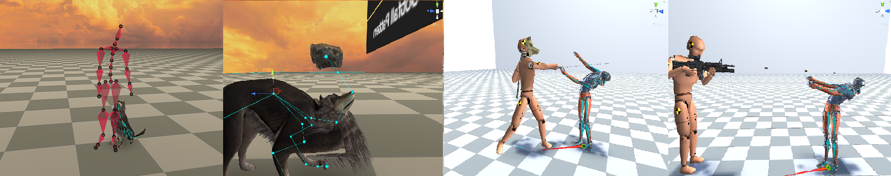
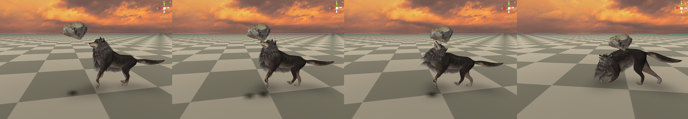
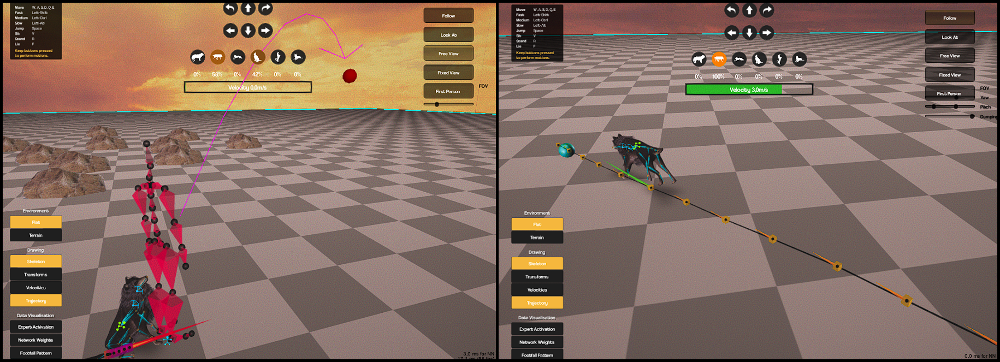
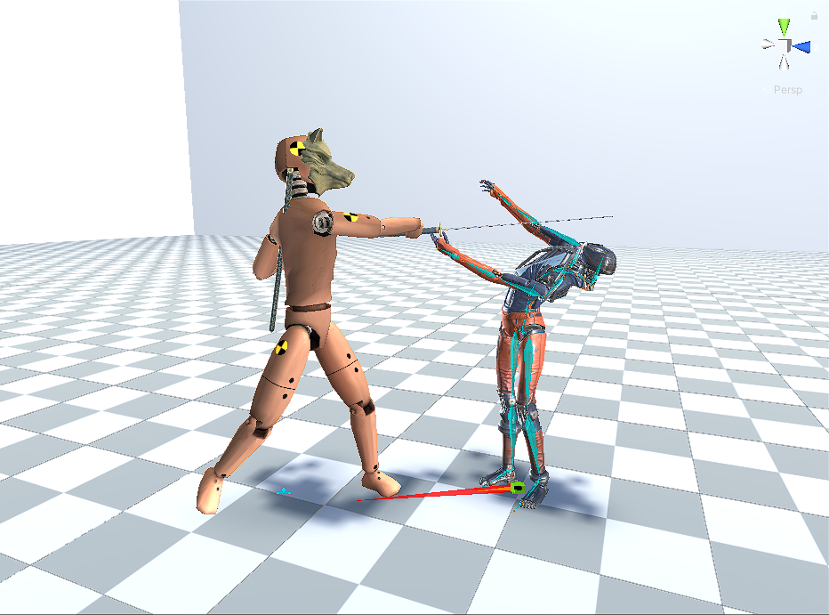
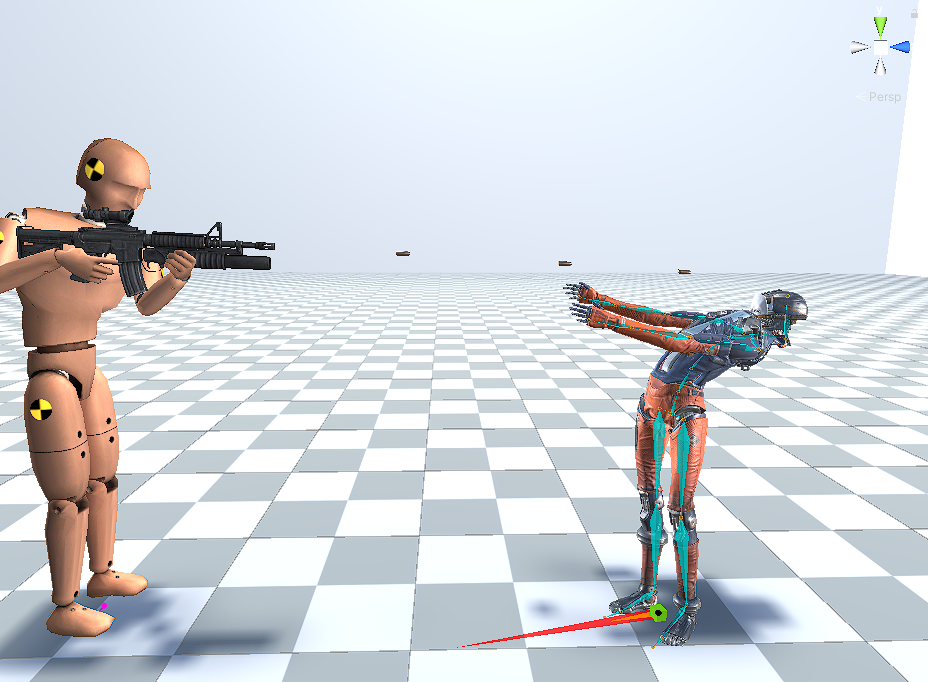

# Thesis: Adaptive Animation

The system proposed in this thesis, describes a colision avoidance technique, using the FABRIK (Forward and Backward Reaching Inverse Kinematics) algorithm, combined with the necessary rotation limits. The whole system is built on <a href = "https://github.com/sebastianstarke/AI4Animation/tree/master/AI4Animation/SIGGRAPH_2018">Sebastian Starke’s Demo</a> with Unity3D and Final IK,  as  a  continuation  of  their  research. The characters can avoid obstacles of various sizes in realtime, while maintaining their original motion produced from the design of the previous system. 

<b>Publication Reference:</b>
<a href = "https://dl.acm.org/doi/abs/10.1145/3197517.3201366?casa_token=Si8lXYxS2h0AAAAA:X73P8o0_hVa_zJVqJIkHjQcIjRf862WHTYIrS_Qw9SJH4US6acQe_MkhbK6gez3CltV5CxcJbL6a">Zhang, H., Starke, S., Komura, T., & Saito, J. (2018). Mode-adaptive neural networks for quadruped motion control. ACM Transactions on Graphics (TOG), 37(4), 1-11.</a>

Using the tools developed for the demo (C# code), new features were added to the project. The user now controls a humanoid character (Adam) and has the wolf as his companion. The latter follows Adam wherever he goes and catches the ball Adam throws, while avoiding obstacles in his path.

The system can be extended to work with biped characters too. Two differnt examples where examined where Adam avoids objects of different sizes.

<b>Publication Reference:</b>
<a href = "https://dl.acm.org/doi/abs/10.1145/3072959.3073663?casa_token=xB3KZm9m7YEAAAAA:W_2ki4SmHXk7LVnLaorvi2dC3ULsPVbCPPYPQqCr9d8i6SuNViMHRqvt2GaEIixsD5FMPBVZEsm0">Holden, D., Komura, T., & Saito, J. (2017). Phase-functioned neural networks for character control. ACM Transactions on Graphics (TOG), 36(4), 1-13.</a>

  
  

------------
Project Information
============ 
This project was developed for research purposes and does not contain a playable application. It was developed by Konstantinos Kalatzis as his thesis for his undergraduate studies at the University of Patras, Greece.
 
Don't forget to visit <a href = "https://github.com/sebastianstarke/AI4Animation">Sebastian Starke’s repository</a> to witness their amazing work.

------------

Copyright Information
============
This project is only for research or education purposes, and not freely available for commercial use or redistribution. The intellectual property for different scientific contributions belongs to the University of Edinburgh, Adobe Systems and Electronic Arts. Licensing is possible if you want to use the code for commercial use. 

The motion capture data is available only under the terms of the [Attribution-NonCommercial 4.0 International](https://creativecommons.org/licenses/by-nc/4.0/legalcode) (CC BY-NC 4.0) license.
